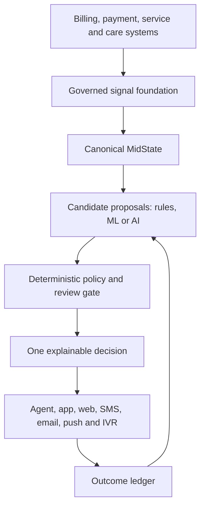

# MIDWARE

### A governed, recursive AI decision architecture

MIDWARE is an executable reference architecture that turns fragmented customer, payment, service, and care signals into one governed and explainable next-best action.

Payments is the first use case—not the boundary of the architecture.

## Executive Summary

Organizations often improve individual error messages, response codes, channels, and customer journeys without creating a shared decision layer beneath them.

MIDWARE explores a broader strategy:

1. Aggregate information from multiple systems.
2. Resolve it into one canonical customer state.
3. Allow rules, machine-learning models, or AI systems to propose actions.
4. Apply deterministic policy, safety controls, and human-review requirements.
5. Distribute one consistent decision across every customer channel.
6. Record the outcome and use it during the next decision cycle.

The result is a small but functional demonstration of governed decision intelligence.

## The Business Problem

A customer attempting to make a payment may simultaneously have:

- An expired payment method
- An overdue balance
- A recent service outage
- An open billing dispute
- A prior payment arrangement
- High recent contact volume
- Different communication permissions
- Conflicting account information across systems

If each channel interprets those facts independently, the organization may produce inconsistent or harmful experiences.

For example, a payment system might recommend collections while a service system knows the company recently caused an outage.

MIDWARE asks:

> What should exist between fragmented organizational knowledge and the action presented to a customer?

## Strategic Thesis

AI should not independently decide what an organization is authorized to do.

AI may propose and rank possible actions. A governed architecture should still control:

- Source authority
- Data quality
- Sensitive information
- Business priority
- Policy restrictions
- Human review
- Customer consent
- Channel availability
- Decision verification
- Outcome measurement

The central principle is:

> Intelligence proposes. Governance decides. Outcomes inform the next cycle.

## Architecture



### Architectural responsibilities

| Component | Responsibility |
|---|---|
| Signal Foundation | Resolves fragmented and conflicting source data |
| MidState | Publishes one canonical representation of the current situation |
| Domain Modules | Add payment, service, care, retention, or future capabilities |
| Candidate Provider | Allows rules, ML, or AI to propose possible actions |
| Governance Policy | Applies deterministic authority, priority, and guardrails |
| Decision Engine | Selects one explainable next-best action |
| Channel Orchestrator | Delivers the same decision consistently across channels |
| Decision Verifier | Independently checks architectural invariants |
| Outcome Ledger | Records results and influences later decisions |

## Worked Example

The included demonstration represents a customer who has:

- A balance of `$164.25`
- A payment that is 34 days past due
- An expired payment method
- A recent service outage
- No prior delinquency
- SMS consent disabled

A payment-only system might immediately request a new payment method.

MIDWARE recognizes that the company recently caused service friction and prioritizes service recovery while suppressing aggressive collections.

## Example Decision Trace

```json
{
  "subject_id": "portfolio-demo",
  "objective": "next_best_action",
  "state_fingerprint": "17a84207ce31ad9a",
  "decision": {
    "decision_id": "dec_3053253f95d9c5562715",
    "domain": "service",
    "action": "service.recovery",
    "priority_tier": 90,
    "confidence": 0.884,
    "reason_codes": [
      "RECENT_SERVICE_OUTAGE",
      "COMPANY_CAUSED_FRICTION"
    ],
    "alternatives": [
      "payments.update_method",
      "payments.offer_arrangement",
      "payments.explain_balance"
    ],
    "suppressed_actions": [
      "collections.aggressive_treatment",
      "collections.disconnect_service"
    ],
    "review_required": false
  },
  "enabled_channels": [
    "agent_desktop",
    "app",
    "web",
    "email",
    "push",
    "ivr"
  ],
  "suppressed_channels": {
    "sms": "sms_consent is false or unavailable"
  },
  "verification": {
    "passed": true
  }
}
```

The fingerprint and decision ID make the reasoning reproducible. Every enabled channel receives the same action, while SMS is suppressed because the customer has not provided consent.

## What v0.7 Demonstrates

- Source precedence when systems disagree
- Canonical and reproducible state identity
- Explainable next-best-action selection
- Separation between AI proposals and organizational authority
- Deterministic policy guardrails
- Human-review gating
- Consent-aware channel orchestration
- Protection against raw payment credentials
- Domain-specific data-quality controls
- Service context influencing payment treatment
- Extension into non-payment domains such as retention
- Outcome feedback changing a future decision
- Sixteen passing architectural tests

## Extensibility

MIDWARE uses domain modules rather than embedding every business problem in one decision engine.

The current implementation includes:

- Customer context
- Payments
- Service recovery
- Care
- A retention extension example

Future modules could include:

- Fraud and identity
- Churn prevention
- Benefits eligibility
- Healthcare navigation
- Customer loyalty
- Technical support
- Regulatory compliance

A new module may introduce signals, candidate actions, validation rules, and policy contributions without rewriting the core runtime.

## Human Review and Safety

In v0.7, `review_required` is an enforced control rather than descriptive metadata.

When review is required:

- Automated customer channels are stopped.
- The decision remains available to a human agent.
- The verifier confirms that the review gate was enforced.

Financial actions are also framed carefully. For example, the system may recommend evaluating eligibility for an SLA credit, but it does not automatically award money.

## My Role

I originated the system thesis, translated an operational payments discussion into architectural requirements, defined the governing principles and failure cases, and used AI coding partners to implement, challenge, test, and refine the reference architecture.

My contribution centers on:

- AI strategy
- Systems thinking
- Product reasoning
- Decision architecture
- Governance design
- Cross-functional translation
- Adversarial testing
- Iterative AI collaboration

This project is intended to demonstrate how a strategist can move from an ambiguous organizational problem to a testable technical model.

## Running the Project

MIDWARE uses only Python's standard library.

### Requirements

- Python 3.10 or newer

### Run

```bash
python3 midware_v07.py
```

The program runs its architectural test suite and prints an example decision trace.

Expected result:

```text
OVERALL: PASS (16/16)
```

## Current Limitations

MIDWARE is a reference architecture, not a production payment platform.

It currently:

- Uses synthetic customer data
- Uses in-memory outcome storage
- Does not connect to production systems
- Does not process payment credentials
- Does not independently certify regulatory compliance
- Uses illustrative business rules rather than company policy
- Demonstrates an AI insertion point without requiring an external model

These boundaries are deliberate. The project tests the architecture surrounding AI before adding a probabilistic model.

## Roadmap

- Add an interactive Streamlit demonstration
- Separate the reference implementation into a small Python package
- Add persistent outcome storage
- Introduce formal module configuration
- Add API endpoints
- Add model-generated candidate proposals
- Compare deterministic and AI-generated recommendations
- Add policy simulation and audit dashboards
- Expand the domain-module library

## Status

Version `0.7.0` is a working portfolio prototype with 16 passing architectural tests.

The project demonstrates the structure surrounding responsible AI decisioning: shared state, constrained intelligence, explainable action, coordinated delivery, and recursive learning.
